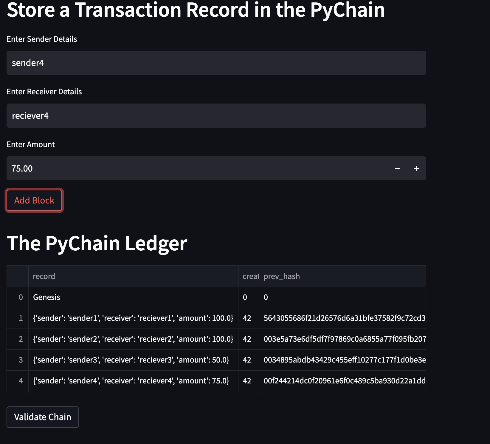
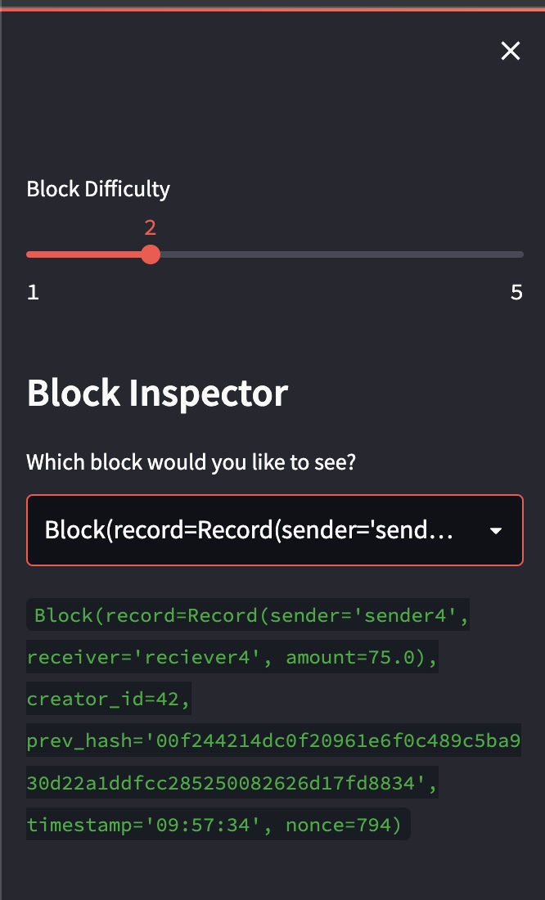
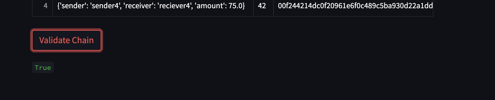

# Unit-18-Blockchain-Homework

This homework assignment builds a PyChain ledger which records the transaction in a block and builds a blockchain with the blocks.

## Foundation Classes

The python file [pychain.py](pychain.py) creates a `StreamLit` application.   The foundation of this python application includes:
- A Record class which has the attributes of sender, reciever and amount.
- A Block class which stores each of the transaction record including the above information in a block along with the creator details and previous block hash.
- A PyChain Ledger class which is effectively the Blockchain consisting of the blocks and also the logic for `Proof of Work` that verify and adds the next block to the block chain.

## Streamlit App

The python file also has the Streamlit App which provides the User Interface for the end user to add new blocks to the PyChain ledger.  Three key inputs are sought from the user viz:
- Sender
- Receiver
- Amount

The above is setup as an instance of the `Record` class and then added to the `Block` and once the `Proof Of Work` is achieved, the block is added to the PyChain Ledger.

## Screenshots
### Add Block

### Block Inspector

### Validate Chain

### App in Action
